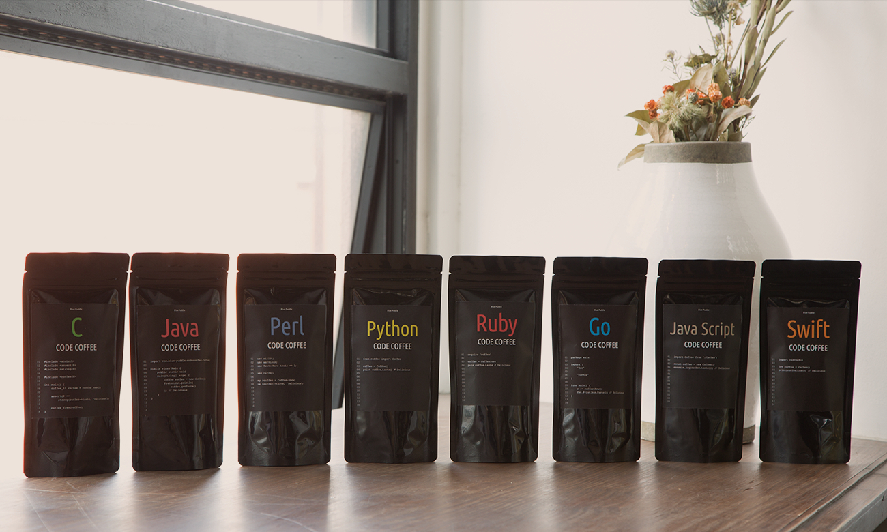

# CODE COFFEE | プログラム言語のコーヒー

## 言語の特長に合わせてコーヒーをブレンドしました

複数のエンジニア監修のもと、８種類の言語で、コーヒーを作りました。クラウドファンディングを利用して、すべて数量限定で販売しております。ごひいきの言語を、ぜひお試しください。

[CODE COFFEE 公式サイト](http://codecoffee.blue-puddle.com/)

[CODE COFFEE クラウドファンディング - Makuake（マクアケ）](https://www.makuake.com/project/code-coffee/)

## COFFEE

### C: すべての源流となる基本言語コーヒー

プログラムの源流となるC言語には、コーヒーの源流であるブラジル・コロンビアのブレンドを作りました。

- 言語の特長: 最もシンプル
- コーヒーの特長: 源流
- ブレンド: ブラジル、コロンビア
- 価格: [1000円(税抜) / 100g](http://codecoffee.blue-puddle.com/)

### Java: 歴史が長く、原始的な言語コーヒー

コーヒーのアイコン・意味を持つ「Java」。言語としての歴史が長く、モダンな言語の祖のような存在なので、コーヒーの原種と言われるエチオピア産モカを中心にしたブレンドで、野生的な味に。

- 言語の特長: 歴史が長い
- コーヒーの特長: 原種
- ブレンド: エチオピア、ブラジル他
- 価格: [1000円(税抜) / 100g](http://codecoffee.blue-puddle.com/)

### Perl: かつて一世を風靡したキリマンジャロ

Perlは、かつて業界でよく使われたけど、最近では使われる機会も減った言語。同じくコーヒー界で一世風靡した、タンザニア産キリマンジャロをベースにブレンドしました。

- 言語の特長: クラシックな人気を誇る
- コーヒーの特長: 一世風靡
- ブレンド: タンザニア、ブラジル他
- 価格: [1000円(税抜) / 100g](http://codecoffee.blue-puddle.com/)

### Ruby: 日本人に飲みやすい「良いとこどり」コーヒー

Rubyは、いろんな言語の特徴のいいとこを取り入れた言語。日本人が開発して、扱いやすい言語。ということで、コーヒーは、４、５種をブレンドし、日本人に飲みやすい人気ロースターチェーンのような味わいに仕上げました。

- 言語の特長: いいとこ取り
- コーヒーの特長: 誰でも美味しい
- ブレンド: ブラジル、グアテマラ他
- 価格: [1000円(税抜) / 100g](http://codecoffee.blue-puddle.com/)

### Python: 機械学習に使われるデカフェコーヒー

Pythonは、人工知能系の開発に最近だとよく使われています。無駄を省き、潔癖的な印象。それを受けて、デカフェをチョイス。カフェイン（が無駄とは言いませんが）を省き、自然物から人工的に生成したコーヒーです。

- 言語の特長: 無駄なし
- コーヒーの特長: デカフェ
- ブレンド: コロンビア
- 価格: [1000円(税抜) / 100g](http://codecoffee.blue-puddle.com/)

### JavaScript: いろんな言語と合う。ミルクと合う。

世界で一番使われている言語ともいえるJavaScript。いろんな言語との相性もよいJSには、カフェオレがよく合うグアテマラブレンドをチョイスしました。

- 言語の特長: いろんな言語と合う
- コーヒーの特長: 初心者にも
- ブレンド: グアテマラ、ブラジル
- 価格: [1000円(税抜) / 100g](http://codecoffee.blue-puddle.com/)

### Go: 無駄のない、唯一無二な独自コーヒー

Goは、Googleが開発した言語。装飾がなく、力強く、厳格な仕様。それに対して、同じく独自性の味わいのある、エチオピア産イルガチェフブレンドをチョイス。独自性のある世界観を味わいください。

- 言語の特長: 独自性
- コーヒーの特長: 希少性
- ブレンド: エチオピア、ブラジル
- 価格: [1000円(税抜) / 100g](http://codecoffee.blue-puddle.com/)

### Swift: アップルフレーバーの革新的コーヒー

SwiftはApple社がもともとiOS用に開発した言語。カジュアルでモダンな言語として人気を集めています。そんな言語には、ストレートにアップルフレーバーをつけました。ブレンドした会社も、この組み合わせは初めてらしく、Appleらしい、イノベーティブなコーヒーができました。

- 言語の特長: Apple社が開発
- コーヒーの特長: アップルフレーバー
- ブレンド: ブラジル、コロンビア他
- 価格: [1000円(税抜) / 100g](http://codecoffee.blue-puddle.com/)
